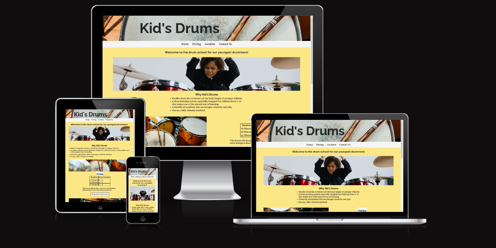

Welcome Markus Hefner,

This is the Code Institute student template for Gitpod. We have preinstalled all of the tools you need to get started. It's perfectly ok to use this template as the basis for your project submissions.

You can safely delete this README.md file or change it for your own project. Please do read it at least once, though! It contains some important information about Gitpod and the extensions we use. Some of this information has been updated since the video content was created. The last update to this file was: **June 18, 2024**

## Gitpod Reminders

To run a frontend (HTML, CSS, Javascript only) application in Gitpod, in the terminal, type:

`python3 -m http.server`

A blue button should appear to click: _Make Public_,

Another blue button should appear to click: _Open Browser_.

To run a backend Python file, type `python3 app.py` if your Python file is named `app.py`, of course.

A blue button should appear to click: _Make Public_,

Another blue button should appear to click: _Open Browser_.

By Default, Gitpod gives you superuser security privileges. Therefore, you do not need to use the `sudo` (superuser do) command in the bash terminal in any of the lessons.

To log into the Heroku toolbelt CLI:

1. Log in to your Heroku account and go to *Account Settings* in the menu under your avatar.
2. Scroll down to the *API Key* and click *Reveal*
3. Copy the key
4. In Gitpod, from the terminal, run `heroku_config`
5. Paste in your API key when asked

You can now use the `heroku` CLI program - try running `heroku apps` to confirm it works. This API key is unique and private to you, so do not share it. If you accidentally make it public, you can create a new one with _Regenerate API Key_.

### Connecting your Mongo database

- **Connect to Mongo CLI on a IDE**
- navigate to your MongoDB Clusters Sandbox
- click **"Connect"** button
- select **"Connect with the MongoDB shell"**
- select **"I have the mongo shell installed"**
- choose **mongosh (2.0 or later)** for : **"Select your mongo shell version"**
- choose option: **"Run your connection string in your command line"**
- in the terminal, paste the copied code `mongo "mongodb+srv://<CLUSTER-NAME>.mongodb.net/<DBname>" --apiVersion 1 --username <USERNAME>`
  - replace all `<angle-bracket>` keys with your own data
- enter password _(will not echo **\*\*\*\*** on screen)_

------

## Release History

We continually tweak and adjust this template to help give you the best experience. Here is the version history:

**June 18, 2024,** Add Mongo back into template

**June 14, 2024,** Temporarily remove Mongo until the key issue is resolved

**May 28 2024:** Fix Mongo and Links installs

**April 26 2024:** Update node version to 16

**September 20 2023:** Update Python version to 3.9.17.

**September 1 2021:** Remove `PGHOSTADDR` environment variable.

**July 19 2021:** Remove `font_fix` script now that the terminal font issue is fixed.

**July 2 2021:** Remove extensions that are not available in Open VSX.

**June 30 2021:** Combined the P4 and P5 templates into one file, added the uptime script. See the FAQ at the end of this file.

**June 10 2021:** Added: `font_fix` script and alias to fix the Terminal font issue

**May 10 2021:** Added `heroku_config` script to allow Heroku API key to be stored as an environment variable.

**April 7 2021:** Upgraded the template for VS Code instead of Theia.

**October 21 2020:** Versions of the HTMLHint, Prettier, Bootstrap4 CDN and Auto Close extensions updated. The Python extension needs to stay the same version for now.

**October 08 2020:** Additional large Gitpod files (`core.mongo*` and `core.python*`) are now hidden in the Explorer, and have been added to the `.gitignore` by default.

**September 22 2020:** Gitpod occasionally creates large `core.Microsoft` files. These are now hidden in the Explorer. A `.gitignore` file has been created to make sure these files will not be committed, along with other common files.

**April 16 2020:** The template now automatically installs MySQL instead of relying on the Gitpod MySQL image. The message about a Python linter not being installed has been dealt with, and the set-up files are now hidden in the Gitpod file explorer.

**April 13 2020:** Added the _Prettier_ code beautifier extension instead of the code formatter built-in to Gitpod.

**February 2020:** The initialisation files now _do not_ auto-delete. They will remain in your project. You can safely ignore them. They just make sure that your workspace is configured correctly each time you open it. It will also prevent the Gitpod configuration popup from appearing.

**December 2019:** Added Eventyret's Bootstrap 4 extension. Type `!bscdn` in a HTML file to add the Bootstrap boilerplate. Check out the <a href="https://github.com/Eventyret/vscode-bcdn" target="_blank">README.md file at the official repo</a> for more options.

------

## FAQ about the uptime script

**Why have you added this script?**

It will help us to calculate how many running workspaces there are at any one time, which greatly helps us with cost and capacity planning. It will help us decide on the future direction of our cloud-based IDE strategy.

**How will this affect me?**

For everyday usage of Gitpod, it doesn’t have any effect at all. The script only captures the following data:

- An ID that is randomly generated each time the workspace is started.
- The current date and time
- The workspace status of “started” or “running”, which is sent every 5 minutes.

It is not possible for us or anyone else to trace the random ID back to an individual, and no personal data is being captured. It will not slow down the workspace or affect your work.

**So….?**

We want to tell you this so that we are being completely transparent about the data we collect and what we do with it.

**Can I opt out?**

Yes, you can. Since no personally identifiable information is being captured, we'd appreciate it if you let the script run; however if you are unhappy with the idea, simply run the following commands from the terminal window after creating the workspace, and this will remove the uptime script:

```
pkill uptime.sh
rm .vscode/uptime.sh
```

**Anything more?**

Yes! We'd strongly encourage you to look at the source code of the `uptime.sh` file so that you know what it's doing. As future software developers, it will be great practice to see how these shell scripts work.

---

Happy coding!


---

# Kid's Drums

Kid's Drums is a drum school for children aged 5-10 years since there are very few drum school who are specialized on this target audience. They curicullum and teaching style is espcially tailored to the learning style of kids that age. 5-10 years was chosen because in Germany it roughly spans the time of elementary school (including the last year of kindergarten) to which the learning system is most applicable.





## User Stories

- As a visitor of this site I want to find a drum teacher for my 6 year old child who just started elementary school.
- As a parent who wants to gather information about a possible drum schools since I quickly want to find information about this particular school.
- As a caring parent who already looked into drum schools I want to know what exactly the differences to a more traditional drum schools are. Furthermore I'd like to easily compare pricing and location.

## Features
- The Header
  - The user will immediately see the school's name.

- Navigation
  - Below the header the user will find navbar links for "Home", "Pricing", "Location" and "Contact Us".
  - While "Home", "Pricing" and "Location" are all on the same page, "Contact Us" is a another page. This is because given that the information on every page would be too sparse to justify rendering a new page.

- The Banner Section
  - The Banner Section gives the a clear, one sentence statement who the school is for.
  - It also provides a hero image to set the tone for the website.

- The Why Section
  - With a simple bullet point list the Why section states why this school is the right school for kids between the ages 5 and 10.

- The Pricing Section
  - Here interested parents/guardians find information about who much the different durations of the lessons will cost them per month.
  - Furthermore they informed that the lessons will take place only outside the school holidays.
  - To speed up the registration process users will also find a direct link the contact us form and encourages them to take a trial lesson which is for free.

- The Location Section
  - User will find the address of the school.

- The Contact Us Page
  - The Contact Us Page presents the user with a form to provide the necessary information.
  - Everything but the phone number are required.
  - The "Submit"-button text is altered to "Count me in!" for it's abiguous meaning: "Count me in!" as in "I'm in" but also "Count me in" like when counting someone in before playing a song. This fit nice with the musical nature of a drum school.

- Footer
  - In the footer user will find all the social media icons which link to their respective social media plattform on which the school is.

## Future Features

- In order to make locating the school more frictionless it would be advantageous to add a google maps widget to the location section.
- To inform users/parents/guardians of the school's activities a "Events" page would be helpful. By showing the school's work in the form of concerts and the like it will enhance the school's visibility in the public and thus driving further client aquistion.
- A dedicated area for enrolled students which is accessible via a dedicated sign in page/window where students and their parents/guardians will find lesson dates, homework info and the scores/exercises will make it easier for the parents/guardians to see the progress their kids make and help the kids out in case the lost some music sheets.

## Typography and Colour Schemes

### Typography
- I used the Raleway and Merriweather fonts since I wanted it to be a bit playful (tiny serifs) to better convey the site's message of being a drum school for kids. However, since it's still adults who will visit the site since they want to find a drum school for kids I didn't want to carry it too far with the embellishments.

### Colour Schemes
- The dominant colours are whitesmoke and a shade of beige. They were chosen because they resemble the colour of a coated drumhead and the wood of a pair of sticks.
Luckily I also was able to find pictures on pexels.com of a drum kit with a similar colour which I then used as dividers between the sections on the homepage as well as on the Contact-Us page
- The hero image as well as the end-of-page image were chosen firstly because the show kids playing drums and secondly because the background was white-ish which works nicely with the navbar and footer colour of whitesmoke.

## Wireframes


## Technology

- Gitpod was used for writing and editing the code.
- GitHub is used for storing the code.
- Font Awesome was used to provide the icon for all social plattforms.
- favicon.io was used to turn the icon into usable code to paste into the head element in order to get a favicon.
- Google Fonts provides the Merriweather and Raleway fonts which were used an all pages of this site.

## Testing

### Code Validation

The W3C Markup Validator and W3C CSS Validator Services were used to check the code of all pages. No error were found.

- index.html
  https://validator.w3.org/nu/?doc=https%3A%2F%2Fmarkus-hefner.github.io%2FPortfolio-Project-1%2F

- contact-us.html
  https://validator.w3.org/nu/?doc=https%3A%2F%2Fmarkus-hefner.github.io%2FPortfolio-Project-1%2Fcontact-us.html

- confirmation.html
  https://validator.w3.org/nu/?doc=https%3A%2F%2Fmarkus-hefner.github.io%2FPortfolio-Project-1%2Fconfimation.html%3Fchilds-first-name%3Dasdf%26childs-last-name%3Dasdf%26childs-age%3D5%26guardians-first-name%3Dasdf%26guardians-last-name%3Dasdf%26email%3Dasdf%2540asdf%26phone%3D

- CSS
  https://jigsaw.w3.org/css-validator/validator?uri=https%3A%2F%2Fmarkus-hefner.github.io%2FPortfolio-Project-1%2Findex.html&profile=css3svg&usermedium=all&warning=1&vextwarning=&lang=de


### User Stories - Test Cases
  - As a visitor of this site I want to find a drum teacher for my 6 year old child who just started elementary school.
  Because of the simple layout of the site I found the Contact Us link right away in the very easily readable navigation bar.
  IMG
  After clicking on it I was re-directed to the site contact us form. I right away clicked on the "Count Me In!"-button. However, I was informed that I first had to put in my child's first name.
  IMG
  After that I clicked again on the "Count Me In!"-button but again I was informed that I had fill out the next input field.
  IMG
  This went on as such until the phone number which I was allowed to skip.
  IMG
  Then I was re-directed to a confirmation page. Since the basic layout was the same from here I had the option to go to homepage, the pricing section, the location section or contact them again by click again on the "Contact-Us"-button.

  - As a parent who wants to gather information about a possible drum schools since I quickly want to find information about this particular school.
  As a first time visitor I was greeted with a welcoming and warm homepage. The color schemes and images immediately established the feeling of drumming and music. In the navigation bar I found links to the different sections and pages. To see the section I could also just scroll down. In order to get a better feeling for the school I chose the latter. All was very clean and I quickly got sense of school and enough information to make an informed desicion.

  - As a caring parent who already looked into drum schools I want to know what exactly the differences to a more traditional drum schools are. Furthermore I'd like to easily compare pricing and location.
  However, I decided to use the links since I find more efficient and I always new were I was. And since the header and title remained at the top of the screen at all times I was able to go from anywhere to everywhere on the site.
  In the pricing section I also found a button for a free trial which led me to the contact us section.
  IMG

### Bugs
- FIXED: At the beginning the background images were used as normal images within the HTML which led to distorted pictures. However, the problem was fixed after the images were loaded in the CSS.
- NOT FIXED: I was unable to get the input field of the form element to get to max-width of 20rem while also being aligned center by the parent container. They are now at their default width which looks a bit odd espacially on larger screen sizes.

### Supported Screens and Browsers
  - The Website was tested with Firefox and Google Chrome.
  - It was viewed stretched from a width of 280px up to a width of 2300px.

## Deployment


